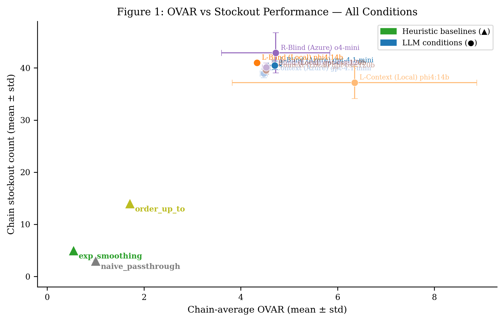
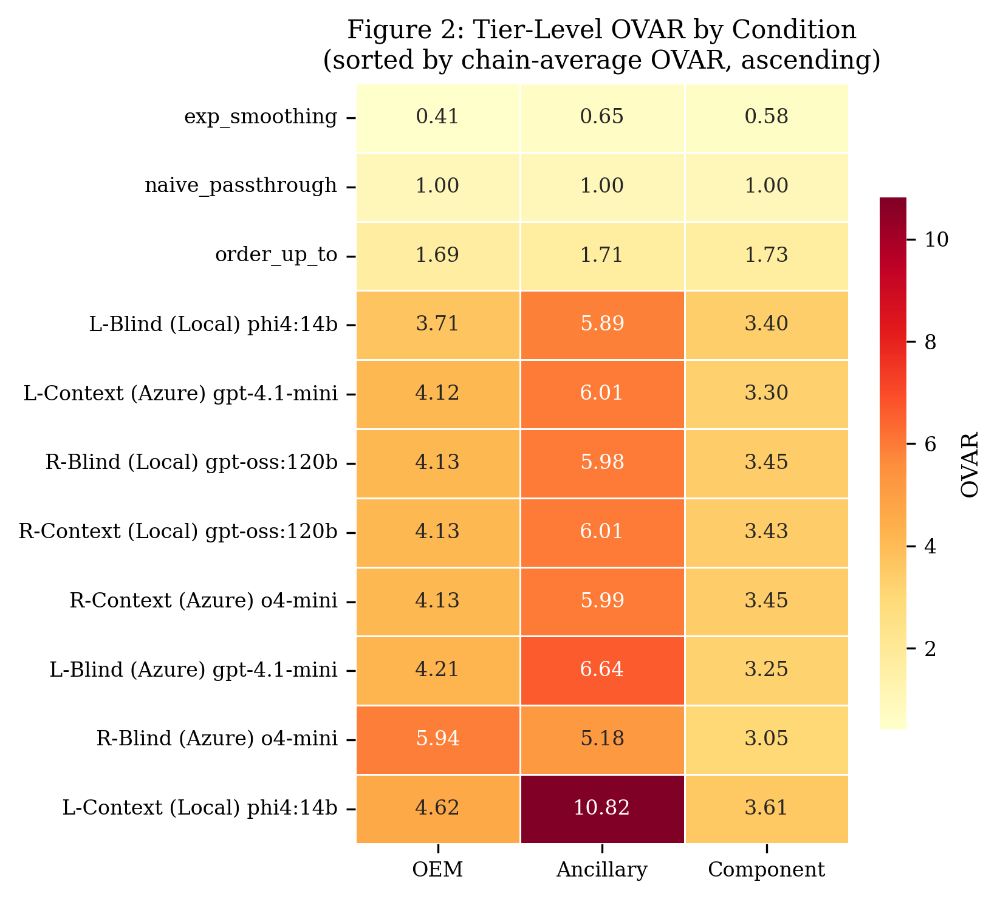
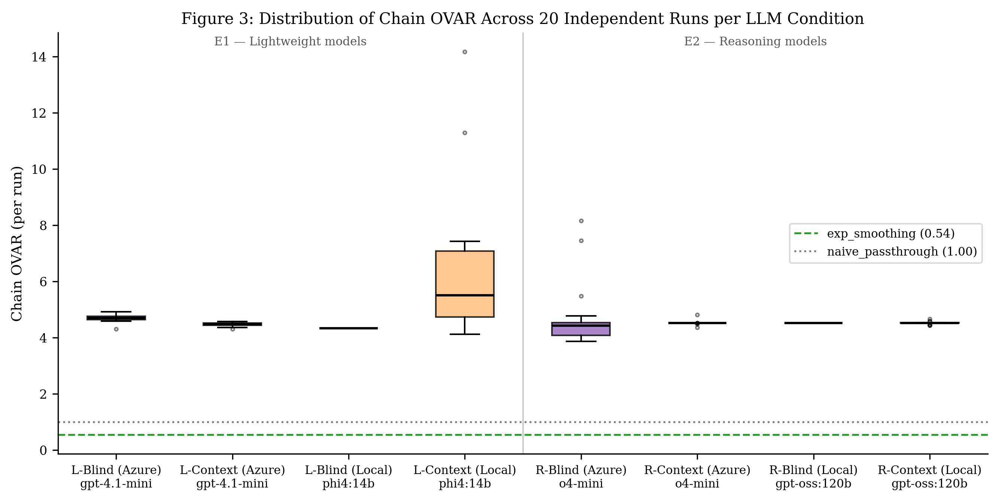
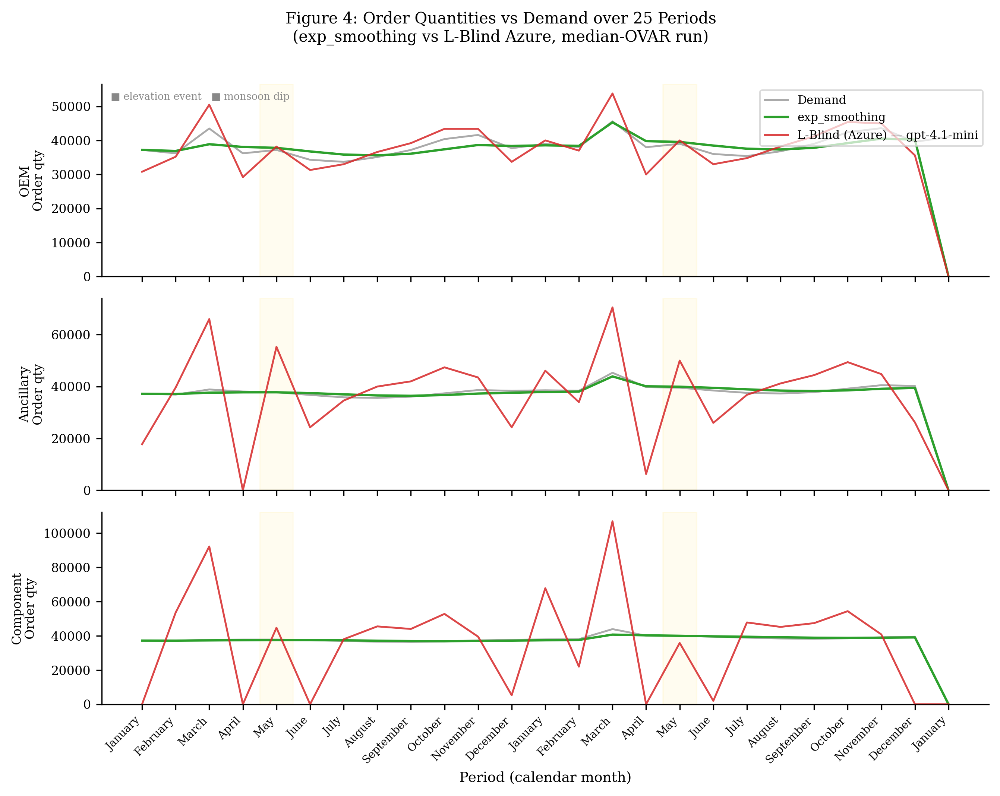

# Agentic Bullwhip: Evaluating LLMs as Supply Chain Planners Against Deterministic Heuristics

**Date:** March 2026
**Author:** Siddharth Srinivasan
**Blog post:** https://www.industrialmindandcode.ai/blog/agentic-bullwhip-v2.html
**GitHub:** https://github.com/SiddharthSrinivasan89/industrial-mind-and-code/tree/main/Agentic_Bullwhip_Effect_Version_2
**Subject:** Research Paper

---

## Abstract

This paper presents the results of a controlled simulation experiment investigating the efficacy of Large Language Models (LLMs) as autonomous supply chain planners. The study tests whether LLM agents can outperform traditional statistical heuristics in a multi-echelon (OEM → Ancillary → Component) environment characterised by 25 periods of synthetic demand, deterministic lead times, and seasonal demand patterns reflecting Indian automotive market dynamics (FY-end peaks, monsoon dips, Diwali surges).

We compared four LLM configurations across two model families and two context conditions, running 20 independent trials per condition. All results were measured against three heuristic baselines run under identical conditions.

**Principal Findings:**

- **Variance dampening.** Exponential smoothing actively dampened order variance to a chain-average OVAR of **0.54**; all LLM configurations produced OVAR between **4.33 and 6.35** — 8–12× higher than the best heuristic, and 4–6× higher than the naive passthrough baseline.

- **Service level failure.** Exponential smoothing generated 5 stockout periods; every LLM condition generated between 37 and 43, a 7–8× increase. No LLM configuration approached heuristic service levels.

- **Context provided no reliable improvement.** For the frontier lightweight model (gpt-4.1-mini), adding supply chain tier persona and the current calendar month reduced OVAR marginally (4.70 → 4.47). For the local lightweight model (phi4:14b), the same context made performance substantially worse (4.33 → 6.35, +47%), with Ancillary tier OVAR reaching 10.8 and a standard deviation of 8.1 between runs — indicating erratic, unpredictable ordering.

- **Reasoning model performance was not distinguishable from lightweight models in this task.** Chain-average OVAR ranges overlapped substantially (o4-mini: 4.52–4.72; gpt-4.1-mini: 4.47–4.70). No formal significance test was run; the comparison conflates model family and quantisation level (and temperature on Azure, though not on local where both tiers ran at identical temperatures) — so the result is directional, not causal.

- **Local and frontier outcomes varied by condition.** For blind conditions, local and frontier OVAR means were within 0.37. For the lightweight context condition, local diverged sharply (Δ=1.87). The local/frontier comparison simultaneously changes the model (phi4:14b vs gpt-4.1-mini; gpt-oss:120b vs o4-mini), quantisation, serving stack (Ollama vs Azure OpenAI), and hardware. Any observed difference could be due to any combination of these factors — this should not be read as a local-vs-cloud infrastructure test.

- **Seasonal event recognition was weak and consistent across conditions.** Aggregate pattern scores across all conditions were low (0.20–0.23), indicating limited alignment between seasonal language cues and correctly directed order adjustments.

**Conclusion:** In this single-product replenishment task with fixed lead times and no unstructured context, LLM agents did not outperform deterministic heuristics. Exponential smoothing outperformed every LLM configuration by a wide margin on both OVAR and service level and stockout count simultaneously. These results should be interpreted within this narrow scope — the study was not designed to, and does not, address broader supply chain settings involving exceptions, multi-supplier negotiation, or unstructured information, nor does it emulate a real-world supply chain with disruptions and stochastic lead times.
---

## 1. Introduction

The Bullwhip Effect — the amplification of order variance as signals propagate upstream through a supply chain — was formally characterised by Lee, Padmanabhan, and Whang (1997) as a primary driver of inventory costs and service failures, arising from rational decision-making within flawed supply chain infrastructures. Traditional statistical heuristics (exponential smoothing, order-up-to policies) are calibrated to dampen this amplification. They achieve this by constraining order quantities to a formula, eliminating the discretionary variability that generates bullwhip.

Building on the foundational diagnosis of Lee, Padmanabhan, and Whang (1997), recent work has examined hybrid ML architectures for bullwhip reduction (Tong, 2025), continuous-time differential equation models (Naik et al., 2025), blockchain-based governance mechanisms (Van Engelenburg et al., 2018), and the emergent behaviour of LLM agents in supply chain settings (Wang et al., 2025; Dhar, 2025; Zhao et al., 2025). However, whether general-purpose LLM agents — without domain-specific training or fine-tuning — can match simple statistical heuristics in a controlled, repetitive replenishment task has not been directly tested. This gap motivates the present study.

As LLMs become capable of acting as autonomous agents, a critical question arises: **can LLMs interpret complex, event-driven demand patterns to smooth orders better than deterministic algorithms?**

We address this question through a rigorous, multi-run simulation of a 3-tier supply chain over 25 periods. We evaluate not just whether LLMs "understand" the demand environment, but whether that understanding translates into better ordering behaviour. The joint reporting of OVAR and stockout count is mandatory: a smoother order pattern achieved by chronic under-ordering is not a success — it is a different failure mode.

### 1.1 Scope and Boundaries

- **Environment:** 3-tier chain (OEM → Ancillary → Component).
- **Lead Time:** 1 month, deterministic. Replenishment ordered in period *t* arrives at the start of period *t+1*.
- **Demand:** Synthetic series calibrated on Indian automotive seasonal patterns (Tatva Motors Vecta). Two full annual cycles (2025–2026), 24 active ordering periods (period 25 is close-out only).
- **Agent Constraints:** Stateless (no memory between periods), JSON-enforced output, zero order floor.
- **Success Criterion:** An LLM configuration must achieve a chain-average OVAR at least 0.5 lower than the best heuristic baseline *without* increasing total stockouts above heuristic levels.

### 1.2 Scope and Generalisability

This study is intentionally narrow. Any finding should be read within its scope:

> *"LLM agents do [or do not] outperform simple blind heuristics in a stylised single-product replenishment task with fixed lead times and no unstructured context."*

These results do not generalise — in either direction — to supply chain management more broadly. Settings that may produce different results include: exception-driven replenishment, multi-supplier negotiation, regime shifts and demand shocks, decisions requiring unstructured context (regulatory text, supplier communications, logistics alerts), and multi-objective tradeoffs. Whether LLMs add value in those settings is an open empirical question not addressed here.

---

## 2. Literature Review

The literature on supply chain optimisation and AI-driven inventory management provides four distinct lines of context for this experiment: (1) the foundational theoretical framework identifying causes and remedies of the bullwhip effect; (2) computational approaches — including hybrid ML architectures, differential equation models, and blockchain governance mechanisms — that extend those remedies; (3) recent evidence on LLM behaviour as autonomous supply chain actors; and (4) systematic evaluation of LLM decision-making biases in inventory contexts.

### 2.1 Foundational Framework: The Bullwhip Effect

Lee, Padmanabhan, and Whang (1997) provide the foundational articulation of the bullwhip effect in their seminal MIT Sloan Management Review paper, demonstrating through case studies at Procter & Gamble and Hewlett-Packard that even stable consumer demand produces exaggerated order swings at upstream tiers. They identify four primary causal mechanisms: (1) *demand forecast updating*, in which each tier re-forecasts from downstream orders, compounding variability; (2) *order batching*, in which periodic or full-truckload ordering amplifies fluctuations; (3) *price fluctuations*, where promotions and forward buying distort true demand signals; and (4) *rationing and shortage gaming*, where anticipated shortages trigger inflated phantom orders. As remedies, they propose three coordination mechanisms: information sharing (point-of-sale data, vendor-managed inventory, electronic data interchange), channel alignment (everyday low pricing, coordinated replenishment), and operational efficiency (just-in-time, reduced lead times).

This study's experimental design deliberately isolates the **demand forecast updating** cause: stateless LLM agents observe each period's state from a single observation window, with no order history, no batching, no price effects, and no shortage gaming. This scope choice is reinforced by Ma and Huo (2025, arXiv:2507.00556), who revisit the order-batching cause using variance decomposition analysis and demonstrate that, under idealized assumptions, order batching does not necessarily produce bullwhip when demand is positively correlated. The seasonal demand series in this experiment exhibits positive autocorrelation; by excluding batching, the experiment isolates the forecasting-update mechanism — the cause Lee et al. show is operative when ordering is continuous and information is asymmetric across tiers.

### 2.2 Hybrid ML Architectures for Bullwhip Reduction

Tong (2025) demonstrates that combining Liquid Neural Networks — which adapt continuously to time-varying dynamics — with XGBoost for global feature optimisation achieves superior bullwhip reduction compared to LSTM, Transformer, and reinforcement learning baselines in multi-tier supply chain simulation (arXiv:2512.14112). The study establishes volatility monitoring and inventory–sales heuristics as stabilising signals, with profitability gains achieved through architectures trained end-to-end against supply chain objectives. This experiment takes a different approach: rather than designing a superior predictive architecture, it evaluates whether general-purpose LLM agents — with no domain-specific training — can arrive at comparable ordering decisions through in-context reasoning. The results indicate they cannot. LLM agents operating on structured prompts amplified demand variance 8–12× above the best heuristic baseline, a failure mode absent from the hybrid ML setting where models are trained to minimise a supply chain cost function directly.

### 2.3 Structural Constraints vs. Flexibility Under Stochastic Demand

Naik et al. (2025) introduce BULL-ODE, a framework applying Neural ODEs and Universal Differential Equations (UDEs) to model bullwhip dynamics under stochastic demand (arXiv:2509.18105). Their central finding is a structural trade-off: UDEs, which embed inventory conservation constraints and order-up-to rules, outperform unconstrained NODEs under autocorrelated and Gaussian demand regimes, while NODEs better capture heavy-tailed lognormal shocks. This trade-off illuminates a parallel in this experiment: the exponential smoothing heuristic — a structure-preserving policy with calibrated parameters — outperformed all LLM configurations by an order of magnitude in a setting with correlated, seasonal demand. Stateless LLM agents, like unconstrained NODEs, must infer inventory dynamics from a single observation window rather than leveraging accumulated structural constraints. The result is consistent with BULL-ODE's finding that structure enforcement is advantageous when demand is correlated and not dominated by rare extreme events — precisely the conditions of this experiment.

### 2.4 Blockchain-Based Governance and Transparency

Van Engelenburg, Janssen, and Klievink (2018) propose a private blockchain architecture to mitigate the bullwhip effect by improving transparency and trust in supply chain information flows. Their central argument is that traditional remedies — information sharing and vendor-managed inventory — often fail due to lack of trust, data manipulation, or siloed systems; blockchain's immutable ledger and decentralised consensus provide a mechanism for secure, verifiable, real-time demand and inventory signal sharing across tiers. Smart contracts enforce replenishment rules and validate transactions, ensuring upstream partners receive accurate demand signals without distortion. Simulation results indicate reduced order variability, enhanced coordination, and lower inventory costs.

This contribution situates the bullwhip problem as partly a *governance* problem — one of data fidelity and partner trust — and extends Lee et al.'s information-sharing remedy into the digital-trust domain. The contrast with this experiment is instructive: blockchain addresses whether shared data can be trusted; this study addresses whether LLM agents can act *correctly* on shared state even when it is accurate. The results suggest that data fidelity alone is insufficient — even with a well-specified inventory state delivered in the prompt, stateless LLM agents produced substantial order amplification.

### 2.5 LLMs as Domain-Specialized Supply Chain Agents

Wang, Jiang, Hong, and Jiang (2025) introduce the first retrieval-augmented generation (RAG) enhanced large language model for supply chain management, demonstrating expert-level performance on standardised SCM certification exams (SCMP, CPIM) and competitive performance in the beer game (arXiv:2505.18597). Through game-theoretic experiments in Cournot and Bertrand competition, LLM agents converge toward equilibrium outcomes; in multi-tier vertical settings, they reproduce classical bullwhip dynamics. Two findings are directly relevant to this experiment: first, **risk preferences strongly influence bullwhip intensity** — risk-averse agents amplify demand variability most, while risk-neutral agents minimise it; second, **information sharing across tiers reduces bullwhip variance dramatically**, with up to 99% reduction at the manufacturer stage for risk-averse agents.

The stateless agents in this study have no explicit risk model and no cross-tier information sharing — conditions under which Wang et al.'s results predict maximal bullwhip amplification. This is precisely what is observed: chain-average OVAR between 4.33 and 6.35, against an exponential smoothing baseline of 0.54. The Wang et al. finding also contextualises the partial context condition: providing tier identity and calendar month falls far short of the information-sharing regimes (full inventory visibility across tiers) that their results show are necessary to materially reduce amplification. Together, these findings suggest that this study's context condition was testing a much weaker form of information provision than the threshold at which information sharing begins to suppress bullwhip.

### 2.6 Agentic AI Failure Modes in Multi-Echelon Systems

Dhar (2025) provides the most direct precedent for this experiment (arXiv:2508.13942). In a multi-echelon simulation, Dhar demonstrates a "collaboration paradox": generative AI agents designed with Vendor-Managed Inventory principles performed worse than non-AI baselines due to a hoarding effect that starved downstream nodes. The study identifies that strategic AI intelligence without operational stability degrades rather than improves supply chain performance, and proposes a two-layer architecture: high-level AI-driven proactive policy-setting combined with low-level collaborative execution. This experiment documents a related but distinct failure mode. Where Dhar's VMI agents failed through strategic mis-calibration — over-committing upstream inventory based on incorrect downstream inference — the stateless LLM agents in this experiment failed through ordering variance amplification independent of strategic intent. The phi4:14b context condition result (Ancillary OVAR 10.82 ± 8.14) mirrors the instability Dhar observed when AI agents received structured supply chain context: contextual signals can trigger commitment to an ordering stance that propagates as amplified upstream shocks. Both studies converge on the conclusion that deploying generative AI in autonomous operational roles introduces failure modes not present in classical heuristics.

### 2.7 Systematic Evaluation of LLM Inventory Biases

Zhao et al. (2025) introduce AIM-Bench, a systematic benchmark for evaluating LLMs as agentic inventory managers across scenarios involving demand uncertainty, lead-time variability, and multi-tier coordination (arXiv:2508.11416). Their results show that LLMs consistently exhibit biases mirroring classical bullwhip dynamics: over-ordering under uncertainty and under-reaction to downstream shortages. This experiment replicates and extends that finding in a controlled multi-run setting. Where AIM-Bench characterises individual decision biases, this study quantifies the aggregate chain-level consequence: LLM ordering biases compound across 24 periods and three tiers, producing chain-average OVAR between 4.33 and 6.35 against a heuristic baseline of 0.54. The determinism observation in this experiment — phi4:14b producing identical order sequences across 20 blind runs — represents an extreme case of AIM-Bench's "under-reaction" bias: the model settles into a fixed ordering pattern and does not adapt to evolving supply chain state. Together, both studies suggest LLM ordering biases are not random noise but systematic distortions that accumulate predictably in sequential replenishment tasks.

### 2.8 Positioning This Experiment

This study complements the above literature on two dimensions. First, it isolates a deliberately narrow task class — single product, fixed lead times, stateless agents, no unstructured context — where deterministic heuristics are expected to perform strongly. This setting establishes a rigorous floor: if LLM agents cannot match simple statistical heuristics in the simplest conceivable replenishment task, this defines where hybrid architectures or more capable frameworks must begin to provide value. Second, it contributes systematic multi-run quantification (20 runs per condition) enabling variance analysis alongside mean performance — an approach not uniformly applied in prior studies. The finding that some model conditions produce zero inter-run variance (rigid ordering) while others produce high variance (erratic ordering) extends the characterisation of LLM decision consistency that AIM-Bench and Dhar (2025) begin to document, and points toward a reliability challenge distinct from average-case performance.

---

## 3. Experimental Design

### 3.1 The Simulation Environment

The simulation executes in discrete monthly periods (*t* = 1 to 25). Each period follows a strict sequence:

1. **Demand Arrival:** Retail demand hits the OEM tier.
2. **Fulfilment:** Each tier serves demand + accumulated backlog from on-hand stock. Unmet demand becomes backlog.
3. **Ordering:** Agents observe their post-fulfilment state (on_hand, backlog) and place an upstream order.
4. **Replenishment:** Orders placed in period *t* arrive as stock at the start of *t+1*.

Period 25 is a close-out period: all tiers fulfil remaining demand but no new orders are placed. This ensures order variance statistics are computed over a clean 24-period ordering window.

### 3.2 Agent Configurations

Four LLM conditions were tested across two experiments (E1: lightweight; E2: reasoning). Three deterministic heuristics served as baselines.

**LLM Conditions:**

| Config | Experiment | Model | Backend | Temperature | Context Provided |
| :--- | :--- | :--- | :--- | :--- | :--- |
| L-Blind (Azure) | E1 | gpt-4.1-mini | Azure OpenAI | 0.4 | No history or events |
| L-Context (Azure) | E1 | gpt-4.1-mini | Azure OpenAI | 0.4 | Tier persona (company, product, role) + current calendar month |
| L-Blind (Local) | E1 | phi4:14b (14.7B, Q4_K_M) | Ollama | 0.0 | No history or events |
| L-Context (Local) | E1 | phi4:14b (14.7B, Q4_K_M) | Ollama | 0.3 | Tier persona (company, product, role) + current calendar month |
| R-Blind (Azure) | E2 | o4-mini | Azure OpenAI | API-constrained (=1.0) | No history or events |
| R-Context (Azure) | E2 | o4-mini | Azure OpenAI | API-constrained (=1.0) | Tier persona (company, product, role) + current calendar month |
| R-Blind (Local) | E2 | gpt-oss:120b (116.8B, MXFP4) | Ollama | 0.0 | No history or events |
| R-Context (Local) | E2 | gpt-oss:120b (116.8B, MXFP4) | Ollama | 0.3 | Tier persona (company, product, role) + current calendar month |

**Note on temperature:** The o4-mini API ignores caller-supplied temperature; the model runs at its internal default (~1.0). This is reflected in the high run-to-run variance observed for R-Blind (Azure) results (§5.6).

**Heuristic Baselines (1 deterministic run each):**

| Heuristic | Description |
| :--- | :--- |
| `exp_smoothing` | Exponential smoothing with α=0.30, safety stock derived from demand series |
| `naive_passthrough` | Each tier orders exactly what was demanded in the prior period |
| `order_up_to` | Order up to a target stock level; target derived from demand statistics |

### 3.3 Metrics

Two primary metrics are reported jointly for every result. Reporting only one is insufficient:

1. **OVAR (Order Variance Ratio):** Var(Orders) / Var(Demand), computed per tier and averaged across the chain.
   - < 1.0: Order variance is dampened — the agent is smoothing.
   - = 1.0: No amplification.
   - \> 1.0: Bullwhip amplification.
   - **MPRD (Minimum Practically Relevant Difference):** |ΔOVAR| ≥ 0.5 required for a result to be considered practically meaningful.

2. **Stockout Count:** Total number of (period, tier) pairs where on-hand stock could not fully cover demand + backlog. Reported as chain total (maximum possible: 75 = 25 periods × 3 tiers).

Secondary metric:

3. **Pattern Score:** Average of (a) keyword score — fraction of event months where the agent's rationale text mentioned relevant seasonal keywords, and (b) elevation score — fraction of event months where order quantity moved in the correct direction (up for elevation events, down for monsoon dip months). A perfect score of 1.0 requires both correct language *and* correct quantities at every event month.

---

## 4. Methodology

### 4.1 Execution Protocol

- **Runs per LLM condition:** 20 independent runs per condition per backend.
- **Heuristic runs:** 1 (fully deterministic).
- **Error handling:** Exponential backoff with 10 retries per API call, cap 60 seconds. Failed runs are replaced to maintain 20 valid runs per condition. Observed retry rate: **0.0%** across all conditions — zero retries were needed.
- **Checkpointing:** Per-condition checkpoint written after each of the 20 runs, enabling recovery from interruption without data loss.

### 4.2 Data and Events

The demand series covers two full annual cycles (Jan 2025 – Jan 2027, 25 periods) with named seasonal event windows:

- **Elevation events:** Makar Sankranti (Jan), Union Budget (Feb), FY-end (Mar), Wedding season (Apr–May), Navratri/Dasara (Oct), Diwali (Nov), Year-end (Dec).
- **Dip events:** Monsoon months (Jun–Aug).

The series is synthetic, generated from real Indian automotive seasonal structure and calibrated to Tatva Motors Vecta dispatch data. The same series and initial stock positions were used across all runs: initial inventory S ≈ 43,609 units (derived as mean + 1.65 × std of the demand series), from which a safety stock of ≈ 5,061 units is derived for use by forecast-based heuristics. A SHA-256 checksum in each provenance file guarantees data integrity across experiments.

### 4.3 Infrastructure

All experiments ran under nohup in a tmux session on an Asus Ascent GX10 (NVIDIA GB10 Blackwell SoC) for local inference, with Azure OpenAI (GlobalStandard tier) for frontier conditions. Experiments ran concurrently: local and cloud runs were executed in parallel sessions.

---

## 5. Results

### 5.1 Heuristic Baselines

Before examining LLM performance, it is essential to understand what the heuristics actually achieve.

| Heuristic | Chain OVAR | Stockouts (of 75 possible) |
| :--- | :---: | :---: |
| `exp_smoothing` | **0.54** | **5** |
| `naive_passthrough` | 1.00 | 3 |
| `order_up_to` | 1.71 | 14 |

The best heuristic, exponential smoothing, does not merely hold OVAR at 1.0 — it actively dampens order variance to 0.54, below the demand variance. This is the correct comparison point for LLM evaluation. No LLM configuration approached this. Naive passthrough, which simply echoes last period's demand, achieves OVAR=1.00 by definition. Order-up-to, the most common textbook policy, generates materially more amplification than the other heuristics (1.71), but still far less than any tested LLM condition.

### 5.2 Primary Finding: Bullwhip Persistence

**No LLM configuration reduced the Bullwhip effect below 4.3 chain-average OVAR.** The gap between LLMs and the best heuristic is not marginal — it is an order of magnitude.

| Condition | Backend | Chain OVAR (mean ± std) | Chain Stockouts (mean ± std) |
| :--- | :--- | :---: | :---: |
| **Heuristic: exp_smoothing** | — | **0.54** | **5** |
| **Heuristic: naive_passthrough** | — | 1.00 | 3 |
| **Heuristic: order_up_to** | — | 1.71 | 14 |
| L-Blind | Azure | 4.70 ± 0.14 | 40.5 ± 0.83 |
| L-Context | Azure | 4.47 ± 0.07 | 39.0 ± 0.83 |
| L-Blind | Local | 4.33 ± 0.00 | 41.0 ± 0.00 |
| L-Context | Local | **6.35 ± 2.53** | 37.2 ± 3.11 |
| R-Blind | Azure | 4.72 ± 1.12 | 42.9 ± 3.85 |
| R-Context | Azure | 4.52 ± 0.08 | 40.1 ± 0.85 |
| R-Blind | Local | 4.52 ± 0.00 | 40.0 ± 0.00 |
| R-Context | Local | 4.52 ± 0.05 | 39.6 ± 0.76 |

No LLM condition satisfies the success criterion. The minimum OVAR achieved by any LLM (4.33, local L-Blind) is still 8× above the best heuristic (0.54) and simultaneously generates 8× the stockouts (41 vs 5). The OVAR/stockout trade-off that might exist between heuristics does not apply here: the LLMs are strictly worse on both dimensions simultaneously.

*Figure 1: Joint OVAR–stockout performance across all conditions. Heuristics (▲) cluster bottom-left; all LLM configurations (●) cluster top-right — strictly worse on both metrics simultaneously.*

**Tier-level OVAR** reveals that Ancillary is consistently the most amplified tier — consistent with classic bullwhip dynamics where middle tiers accumulate the most distortion:

| Condition | Backend | OEM | Ancillary | Component |
| :--- | :--- | :---: | :---: | :---: |
| exp_smoothing | — | 0.41 | 0.65 | 0.58 |
| L-Blind | Azure | 4.21 | **6.64** | 3.25 |
| L-Context | Azure | 4.12 | 6.01 | 3.30 |
| L-Blind | Local | 3.71 | 5.89 | 3.40 |
| L-Context | Local | 4.62 | **10.82** | 3.61 |
| R-Blind | Azure | 5.94 | 5.18 | 3.05 |
| R-Context | Azure | 4.13 | 5.99 | 3.45 |
| R-Blind | Local | 4.13 | 5.99 | 3.45 |
| R-Context | Local | 4.13 | 6.01 | 3.43 |

*Figure 2: Tier-level OVAR heatmap by condition, sorted by chain-average OVAR (ascending). Ancillary is consistently the most amplified tier across all LLM configurations.*

### 5.3 The Context Effect

**For cloud lightweight (gpt-4.1-mini):** context marginally reduced chain OVAR (4.70 → 4.47, Δ=−0.23) and stockouts (40.5 → 39.0, Δ=−1.5). The Δ is below the MPRD threshold of 0.5; the improvement is not practically meaningful.

**For local lightweight (phi4:14b):** context made performance dramatically and unpredictably worse. Chain OVAR increased from 4.33 to 6.35 (+47%), with a standard deviation of 2.53 — indicating some runs were near the cloud average while others were catastrophically high. The Ancillary tier was the failure point: OVAR 10.82 ± 8.14. In the worst observed runs, Ancillary OVAR exceeded 20. Stockouts improved slightly (41.0 → 37.2) only because some runs under-ordered severely — reducing stockout count by accepting chronic inventory starvation rather than service.

**For reasoning models (both backends):** context provided no practically meaningful OVAR improvement. R-Blind Azure (4.72) vs R-Context Azure (4.52): Δ=−0.20, below MPRD. R-Blind local (4.52) vs R-Context local (4.52): Δ≈0.

The pattern is consistent: context does not help and can hurt. It adds signal that agents cannot reliably translate into correctly-sized quantity adjustments.

### 5.4 Lightweight vs Reasoning: No Material Difference

| | Azure | Local |
| :--- | :---: | :---: |
| Best lightweight OVAR | 4.47 (L-Context) | 4.33 (L-Blind) |
| Best reasoning OVAR | 4.52 (R-Context) | 4.52 (R-Blind) |

Reasoning models (o4-mini, gpt-oss:120b) showed no observed ordering advantage over lightweight models (gpt-4.1-mini, phi4:14b) in this task. On the cloud, lightweight OVAR means were marginally lower. On local, the two families were nearly identical in the blind condition. The additional compute cost of reasoning models — o4-mini generated 1,083,968 reasoning tokens vs 101,879 completion tokens for gpt-4.1-mini — did not correspond to any measurable ordering improvement.

**Important caveat:** On Azure, this comparison conflates model family, quantisation level, serving stack, and temperature (gpt-4.1-mini at T=0.4 vs o4-mini API-constrained at ~1.0). On local, temperatures were identical across model tiers (phi4:14b and gpt-oss:120b both at T=0.0 blind / T=0.3 context), removing temperature as a confound — but model family, quantisation, and parameter count still differ. The experiment was not designed to isolate the effect of reasoning capability alone from these confounding factors. The directional finding is that spending more on inference did not help; the causal attribution to "reasoning" specifically is not cleanly supported.

The high variance of R-Blind Azure (chain OVAR std=1.12, OEM std=3.91) reflects o4-mini's API-constrained temperature (~1.0). The model occasionally generated very high-confidence large orders that propagated as a shock upstream, producing outlier OVAR values. Context reduced this variance substantially (std: 1.12 → 0.08), suggesting context partially constrains the model's ordering range — though not toward the correct level.

### 5.5 Local vs Frontier Inference: Conditional Equivalence

The local/frontier comparison must be split by condition — the aggregate "equivalent" claim obscures a critical divergence:

| Condition | Azure OVAR | Local OVAR | |Δ| | Equivalent? |
| :--- | :---: | :---: | :---: | :---: |
| L-Blind | 4.70 | 4.33 | 0.37 | Borderline (within ±0.5) |
| L-Context | 4.47 | 6.35 | **1.87** | No — diverges significantly |
| R-Blind | 4.72 | 4.52 | 0.20 | Yes |
| R-Context | 4.52 | 4.52 | 0.00 | Yes |

**The lightweight context condition is where local and frontier diverge.** phi4:14b (local) became highly unstable under the longer context prompt, while gpt-4.1-mini (frontier) remained tightly distributed. This suggests phi4:14b's ordering behaviour is sensitive to prompt length or structure in a way that gpt-4.1-mini is not.

**For reasoning model conditions, observed OVAR means were nearly identical** (R-Context Δ=0.00, R-Blind Δ=0.20). However, this comparison reflects the combined effect of model (gpt-oss:120b vs o4-mini), quantisation (MXFP4 vs frontier float), serving stack, and hardware. The experiment does not isolate infrastructure from model differences. The result shows that local and frontier produced similar observed outcomes in this task; it does not establish that the two stacks are equivalent in general.

### 5.6 Determinism and Variance

A notable empirical observation: two local model configurations produced perfectly deterministic output across all 20 runs.

| Config | Temperature | Chain OVAR std |
| :--- | :---: | :---: |
| L-Blind (Local, phi4:14b) | 0.0 | ~0 |
| R-Blind (Local, gpt-oss:120b) | 0.0 | ~0 |

Both models ran at T=0.0 in the blind condition, so deterministic output is the expected consequence of greedy decoding. The observation is not that the models happened to be rigid — it is that greedy decoding produces a fixed ordering pattern that does not adapt to evolving supply chain state, generating bullwhip by construction. Notably, when phi4:14b was given context at T=0.3 (the L-Context Local condition), the additional prompt content and non-zero temperature produced extreme variability (chain OVAR std=2.53) rather than improved ordering — determinism and instability are failure modes on opposite ends of the same spectrum.

By contrast, o4-mini at its API-constrained temperature produced chain OVAR standard deviation of 1.12 across 20 runs (blind condition) — the most variable configuration in the experiment. High stochasticity in reasoning did not improve outcomes; it just made them unpredictable.

*Figure 3: Distribution of chain OVAR across 20 independent runs per LLM condition. Dashed lines mark exp_smoothing (0.54) and naive_passthrough (1.00). L-Blind (Local) and R-Blind (Local) collapse to a single point — zero inter-run variance.*

### 5.7 Event Recognition (Pattern Score)

| Condition | Backend | Pattern Score (mean ± std) |
| :--- | :--- | :---: |
| L-Blind | Azure | 0.21 ± 0.00 |
| L-Context | Azure | 0.22 ± 0.01 |
| L-Blind | Local | 0.20 ± 0.00 |
| L-Context | Local | 0.22 ± 0.02 |
| R-Blind | Azure | 0.22 ± 0.02 |
| R-Context | Azure | 0.22 ± 0.01 |
| R-Blind | Local | 0.23 ± 0.00 |
| R-Context | Local | 0.22 ± 0.01 |

The pattern score (0.0–1.0) is the simple average of two independent sub-scores: keyword score (fraction of event months where the rationale mentioned seasonally relevant terms) and elevation score (fraction of event months where order quantity moved in the correct direction). A composite score of 0.22 does not mean agents succeeded on both components simultaneously 22% of the time — an agent scoring 0.44 on keywords and 0.00 on elevation would also produce 0.22. The two sub-scores are not available separately in the aggregated summary output.

Three observations:

1. **Pattern scores are indistinguishable across all conditions.** Blind and context models score identically. Lightweight and reasoning score identically. Cloud and local score identically. The calendar month signal makes no measurable difference to whether agents act correctly at event months.

2. **The score reflects two separate failures.** An agent can mention "Diwali approaching" in its rationale and still place a low order (keyword credit, no elevation credit) — or place a high order while citing unrelated logic (elevation credit, no keyword credit). The aggregated score of 0.22 does not distinguish these failure modes, but both indicate a gap between articulation and execution.

3. **The context treatment was designed to help here most.** Agents in L-Context and R-Context were given tier identity (company name, product, role) and the current calendar month — enough for a model with world knowledge to infer "November = Diwali." Despite this signal, pattern scores were unchanged from blind conditions. The calendar month was available; the translation into correctly-sized quantities was not.

### 5.8 Hypothesis Verdicts

All hypotheses required |ΔOVAR| ≥ 0.5 (MPRD) at chain level. OVAR and stockout count are reported jointly for each verdict.

| Hypothesis | Prediction | Result | Verdict |
| :--- | :--- | :--- | :---: |
| **H1** (Layer 1 — Primary) | At least one LLM achieves lower chain-average OVAR than exp smoothing (0.54) with ≤5 stockouts | Best LLM: OVAR 4.33, stockouts 41. Heuristic: OVAR 0.54, stockouts 5. | REJECTED |
| **H2** (C1 — Context, lightweight) | context_lightweight OVAR < blind_lightweight by ≥0.5, no increase in stockouts | Δ = 4.70 − 4.47 = 0.23 — below MPRD | REJECTED |
| **H3** (C2 — Context, reasoning) | context_reasoning OVAR < blind_reasoning by ≥0.5, no increase in stockouts | Δ = 4.72 − 4.52 = 0.20 — below MPRD | REJECTED |
| **H4** (C3 — Reasoning, no context) | blind_reasoning OVAR < blind_lightweight by ≥0.5 | Δ = 4.70 − 4.72 = −0.02 — opposite direction | REJECTED |
| **H5** (C4 — Reasoning, with context) | context_reasoning OVAR < context_lightweight by ≥0.5 | Δ = 4.47 − 4.52 = −0.05 — opposite direction | REJECTED |
| **H6** (C5 — Interaction) | Context benefit larger for reasoning than lightweight (C5 = C2 − C1 > 0) | C5 = 0.20 − 0.23 = −0.03 — opposite direction | REJECTED |
| **H7** (E4 — Local/frontier replication) | Local context_lightweight within ±0.5 OVAR of frontier context_lightweight | Δ = 6.35 − 4.47 = 1.88 — well outside ±0.5 equivalence bounds | REJECTED |

All seven hypotheses were rejected. H1 — the primary layer one question — was rejected by the widest margin: the best LLM configuration produced OVAR 8× above the best heuristic while simultaneously generating 8× more stockouts. H2 and H3 were rejected on the MPRD threshold: context produced directional improvements for frontier models, but neither reached the 0.5 OVAR unit threshold required for a practically meaningful claim. H4 and H5 show reasoning models performed no better than lightweight — the contrast was negative in both conditions. H7 confirms that the local/frontier divergence under the context condition was substantial and practically significant, not noise.

---

## 6. Discussion

### 6.1 Structural Mechanisms of Bullwhip Amplification

The results indicate that the bullwhip failure is structural, not a matter of model capability or prompt quality.

**Statelessness compounds over time.** Each period, the agent sees only the current prompt — it has no memory of the order it placed in *t*−1 or the stockout it caused in *t*−2. The supply chain state it inherits (high backlog, low on-hand) was partly its own creation, but it has no causal chain connecting that state to its past decisions. Without this, there is no mechanism for the agent to self-correct a drift toward over- or under-ordering.

**Quantity estimation is not what LLMs optimise for.** LLMs are trained on text prediction tasks where precise numerical outputs rarely carry direct consequence. "Order 6,800 units" vs "order 7,200 units" generates similar training signal if both are plausible responses to the context. The model has no intrinsic motivation to hit a specific quantity range, whereas the heuristic's formula guarantees it.

**Discretion generates variance.** Every period, an LLM makes a fresh judgement call. Even a well-calibrated model will exhibit run-to-run variance in this call, which manifests directly as order variance. A deterministic formula has zero within-run variance by construction. The OVAR comparison is, in a sense, a comparison between the variance introduced by formula (≈0) versus the variance introduced by LLM discretion (substantial).

**Reasoning does not narrow the gap.** o4-mini generated over 1 million reasoning tokens during E2 — long internal chains of thought on each ordering decision. These reasoned orders were not closer to the optimal quantity than gpt-4.1-mini's simpler outputs. The reasoning capacity was applied to contextual interpretation, not to numerical convergence.

These failure modes are consistent with the systematic ordering biases AIM-Bench documents in LLM inventory agents (Zhao et al., 2025) and with the operational instability Dhar (2025) observes in AI-driven VMI systems — both of which converge on the conclusion that LLM agents in autonomous operational roles introduce failure modes not present in classical heuristics.

*Figure 4: Order quantities vs demand over 25 periods for exp_smoothing and the median-OVAR run of L-Blind (Azure). Gold shading marks elevation event months; blue shading marks monsoon dip months. exp_smoothing closely tracks demand; the LLM agent amplifies it.*

### 6.2 Context-Driven Instability in Capacity-Constrained Models

The L-Context (local) result deserves specific attention. Adding the tier persona and current calendar month to phi4:14b's prompt did not help it order better — it destabilised an otherwise rigid model. The Ancillary tier's standard deviation of 8.14 OVAR across 20 runs indicates some runs had near-normal Ancillary variance while others were extreme outliers.

This likely reflects a threshold effect in the model's attention over longer prompts: when the context triggered a particular interpretation of the demand pattern, the model committed to an aggressive order stance that then propagated as an amplified shock upstream. The rigid blind model, repeating the same order every run, at least produced *predictable* underperformance.

### 6.3 The Order-Up-To Comparison

A secondary finding worth noting: `order_up_to` — one of the most widely deployed inventory policies — produced OVAR of 1.71, well below the LLM range of 4.33–6.35 but 3× above the best heuristic (exp_smoothing at 0.54). This suggests that the bullwhip problem is not unique to AI agents; naive policy design can generate significant amplification. The differentiator is `exp_smoothing` with α=0.30, calibrated against this demand series. The conclusion is not that LLMs are uniquely bad relative to all heuristics, but that well-calibrated statistical heuristics set a high bar that no tested LLM configuration approached.

### 6.4 Practical Implications

- **Our results indicate that LLM agents are not suitable as autonomous order-placement agents in replenishment tasks with this profile.** The observed gap to a simple statistical heuristic is large and was not closed by any combination of model size, context, or backend. Whether this finding extends to more complex supply chain settings — exceptions, disruptions, multi-objective tradeoffs — is outside the scope of this study.

- **Higher inference spend produced no observed improvement in ordering outcomes in this task.** Upgrading from a lightweight to a reasoning model cost 3.4× more in mean call latency and substantially more in tokens, with no observed OVAR or stockout improvement. The reasoning/lightweight comparison is confounded by model family (and by temperature on Azure, though local conditions used identical temperatures across both tiers), so this should be treated as a directional finding rather than a causal one.

- **Local and frontier deployments produced similar outcomes in the reasoning model conditions.** The comparison conflates model, quantisation, stack, and hardware, so it should not be read as an infrastructure equivalence test. The practical takeaway is narrow: in this task, local gpt-oss:120b and frontier o4-mini produced similar OVAR means with zero failures on both sides.

- **LLMs appear to have a role in the planning loop rather than the execution loop.** Pattern scores, while low in absolute terms, show that agents consistently produce articulate rationales naming seasonal dynamics. This capability — generating explanations for demand movements — is where LLMs create value. Hybrid systems that use LLM analysis to adjust the *parameters* of a deterministic model (e.g., modifying safety stock for a Diwali window) represent a more promising architecture than fully autonomous LLM ordering. This is consistent with Dhar's (2025) two-layer synthesis — high-level AI-driven policy-setting combined with deterministic execution — and with the hybrid architecture demonstrated by Tong (2025).

---

## 7. Conclusion

We tested the hypothesis that LLM agents — including state-of-the-art reasoning models — can outperform traditional statistical heuristics in supply chain order management. **The hypothesis was rejected across all configurations and both model families.**

In this task — single product, fixed lead times, three tiers, 24 ordering periods, stateless agents — the exponential smoothing heuristic achieved OVAR=0.54 and 5 stockouts. Every LLM configuration produced chain-average OVAR between 4.33 and 6.35 and between 37 and 43 stockouts. Within the bounds of this study, no combination of model size, context treatment, or backend closed that gap.

These findings are specific to the task tested. This study was deliberately scoped to a stable, low-information, single-product setting — the class of problem where heuristics are known to be strong competitors. Results should not be extrapolated to supply chain settings involving exceptions, disruptions, unstructured information, or multi-objective decisions. In particular, the LLM planning and rationale capability observed through the pattern score component suggests that agents may add value in settings that require interpretation of unstructured signals or exception handling — settings outside the scope tested here.

For replenishment tasks with the profile studied (single product, fixed lead times, low information state), our results indicate that heuristics are faster, cheaper, more predictable, and substantially more effective on both primary metrics. Higher inference spend produced no ordering benefit: the latency and token cost of reasoning models (3.4× mean call time) corresponded to no observed OVAR or stockout improvement, a directional finding that should not be read as a controlled comparison of reasoning capability alone. For organisations evaluating local inference for simulation workloads, the reasoning model conditions provide a narrow datapoint: local gpt-oss:120b produced similar OVAR means to frontier o4-mini with zero failures and lower latency variance (p95: 6,844ms vs 11,128ms), though the comparison conflates model, quantisation, and stack differences and cannot be generalised.

Where LLM value is more plausible, it is in the planning loop rather than the execution loop — generating demand commentary, flagging seasonal anomalies, or parameterising safety stock adjustments for a deterministic model to execute. Future work should examine whether hybrid architectures of this type — using LLM reasoning to adjust the parameters of a deterministic ordering policy — can bridge the gap between semantic planning capability and the numerical precision that fully autonomous LLM agents did not demonstrate in this setting.

---

## Appendix: Technical Notes

**Experiment structure:**

| Experiment | Conditions | Runs | Total API calls | Wall time |
| :--- | :--- | :---: | :---: | :--- |
| Baselines | 3 heuristics | 1 each | 0 | < 1 min |
| E1 (Azure) | blind_lw, context_lw | 20 each | 2,880 | ~82 min |
| E1 (Local) | blind_lw, context_lw | 20 each | 2,880 | ~111 min |
| E2 (Azure) | blind_rsn, context_rsn | 20 each | 2,880 | ~278 min |
| E2 (Local) | blind_rsn, context_rsn | 20 each | 2,880 | ~244 min |

API calls per condition = 20 runs × 3 tiers × 24 ordering periods = 1,440.

**Retry and parse errors:** Retry rate = 0.0% across all 11,520 LLM calls. No runs required replacement.

**Temperature notes:** gpt-4.1-mini ran at T=0.4 in E1. phi4:14b ran at T=0.0 (blind) and T=0.3 (context) in E1. o4-mini (Azure) is API-constrained to internal temperature ≈ 1.0 regardless of caller-supplied value. gpt-oss:120b ran at T=0.0 (blind) and T=0.3 (context) in E2.

**Determinism observation:** phi4:14b at T=0.0 (blind condition) and gpt-oss:120b at T=0.0 (blind condition) produced zero inter-run variance across 20 runs. Standard deviation was at machine epsilon (~9×10⁻¹⁶). This is the expected result of greedy decoding (T=0.0) given identical prompts.

**Data integrity:** SHA-256 checksum `c9b26afdbfd551f4f88f72eb119292a3ed0e9c2619c787a26b29d63250539c4e` recorded in E1/E2 provenance files confirms identical demand series across all runs.

**Result artifacts:** Raw run outputs (`records.parquet`, `summary.json`, `provenance.json`) are written by the runner to `results/<experiment>/<timestamp>/` and are required for full auditability and reproducibility. Summary statistics and provenance details in this paper are derived from those files. Anyone seeking to verify or reproduce individual run-level results should locate or regenerate those artifacts; the summary statistics reported here cannot substitute for them.

**Disclaimer:** Personal experiments. Data is synthetic. No employer, vendor, or technology partner data was used. Local compute runs on an Asus Ascent GX10 with NVIDIA GB10 Blackwell SoC — personally owned. Azure and other AI subscriptions are personal in nature. 