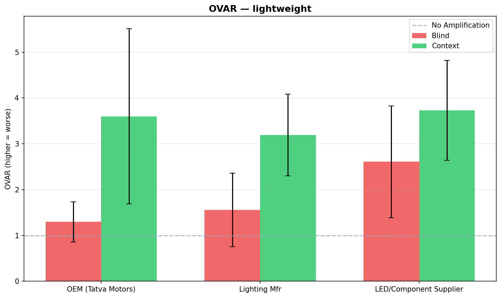
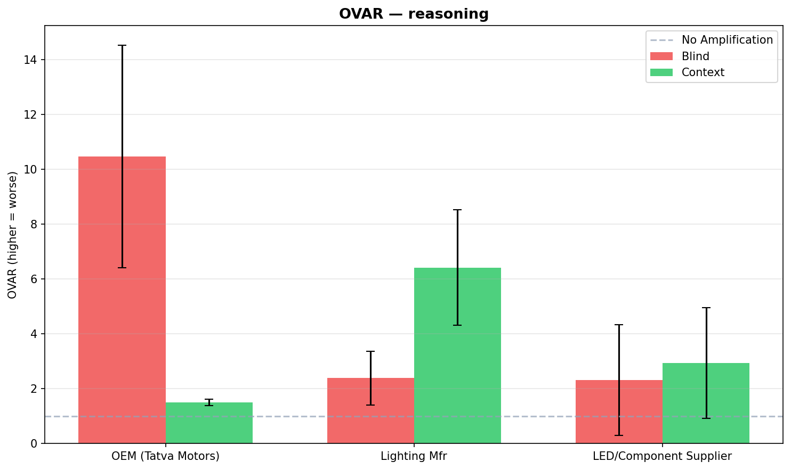
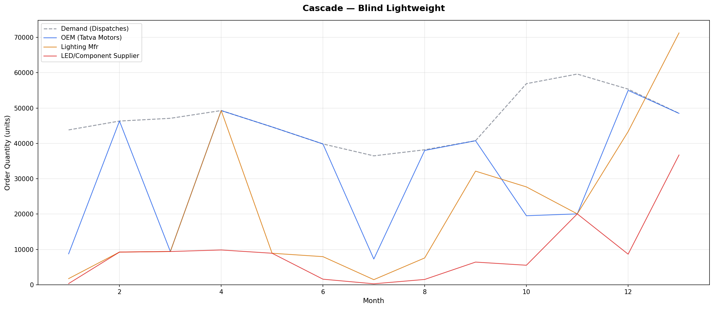
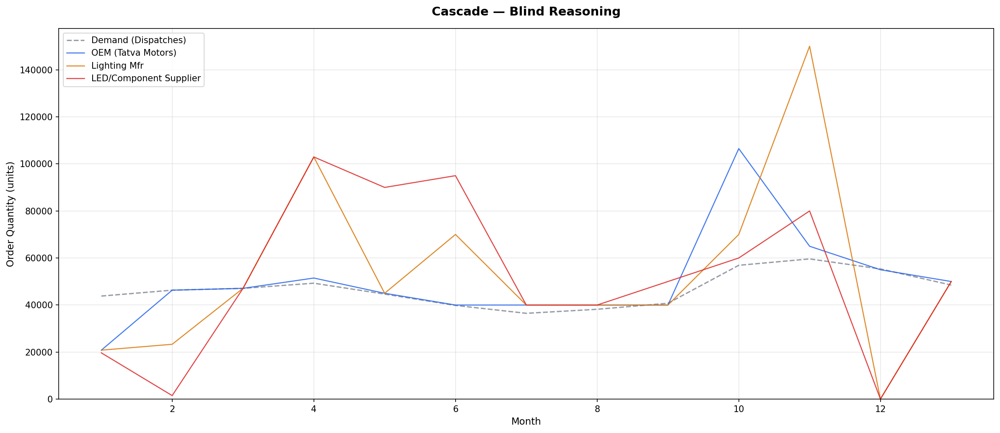
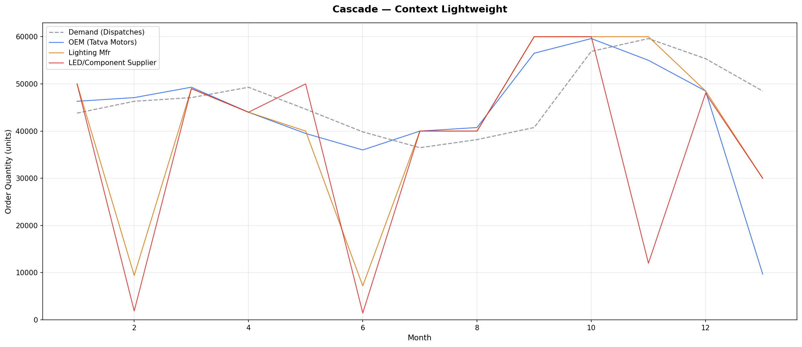
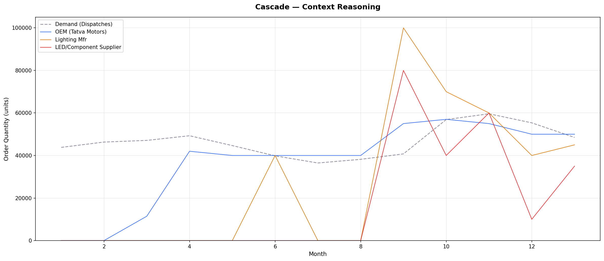
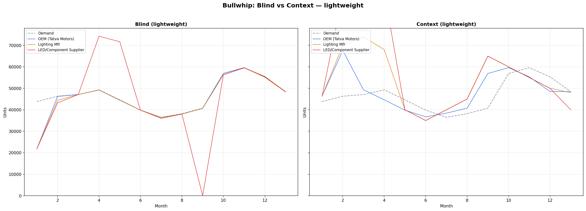
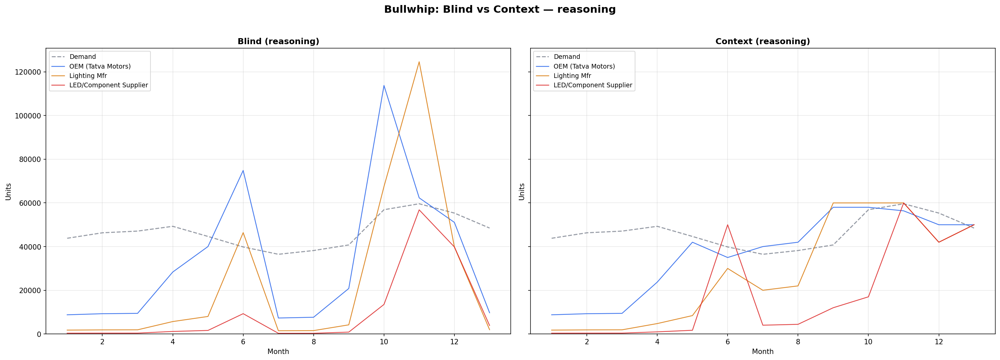

# The Agentic Bullwhip Effect

Can LLM-powered supply chain agents make smarter ordering decisions when given real-world context — or do they amplify demand distortion just like humans do?

This experiment simulates a 3-tier Indian automotive supply chain where each tier's ordering decisions are made by an LLM agent. We measure how order variance amplifies (or dampens) as it moves upstream, and whether giving agents contextual knowledge about seasons, festivals, and market patterns reduces the distortion.

> **Disclaimer**: This is a personal research project run on a personal Azure subscription. All demand data is synthetic, modelled after real-world patterns in the Indian automotive industry (monthly vehicle dispatches, seasonal trends, festive-period surges). The company "Tatva Motors" and the "Vecta" model are fictional. No proprietary or confidential data was used.

---

## What is the Bullwhip Effect?

The Bullwhip Effect is a well-documented supply chain phenomenon where small fluctuations in consumer demand get progressively amplified as orders move upstream through the supply chain. A 5% increase in retail sales might become a 10% increase at the distributor, a 20% increase at the manufacturer, and a 40% increase at the raw material supplier.

This happens because each participant in the chain makes independent ordering decisions based on incomplete information — they see their immediate customer's orders but not the end-consumer demand. They tend to over-order when demand rises (to build safety stock) and under-order when it falls (to reduce inventory), creating oscillations that grow larger at each step. The result is excess inventory, stockouts, wasted production capacity, and increased costs across the entire chain.

---

## Experiment Setup

### Supply Chain Structure

```
Consumer Demand (Tatva Motors Vecta production targets)
    |
    v
[OEM — Tatva Motors]          Tier 1: Vehicle assembly, orders headlight assemblies
    |
    v
[Lighting Manufacturer]       Tier 2: Assembles LED headlights for the Vecta
    |
    v
[LED Module Supplier]         Tier 3: Produces LED modules and components
```

Each tier receives orders from the tier above, decides how many units to order from the tier below, and ships from its own inventory. No tier sees the original consumer demand except the OEM. The Lighting Manufacturer sees only the OEM's orders; the LED Supplier sees only the Lighting Manufacturer's orders.

### Demand Data

13 months of synthetic monthly Vecta dispatches (December 2024 to December 2025), ranging from 36,478 to 59,608 units per month. Total demand across all 13 periods: 606,771 units. The data embeds realistic Indian automotive patterns:

- **FY-end push** (March): Elevated dispatches before the April financial year boundary
- **Monsoon dip** (June-July): Reduced dispatches during India's rainy season
- **Festive surge** (September-November): Peak dispatches driven by Navratri, Diwali, and the wedding season

### Configurations

A 2x2 experimental matrix testing two independent variables:

| | **Blind** (no context) | **Context** (dates, product, market) |
|---|---|---|
| **gpt-4.1-mini** (lightweight) | Blind Lightweight | Context Lightweight |
| **o1** (reasoning) | Blind Reasoning | Context Reasoning |

- **Blind agents** see only: current inventory, backlog, orders in transit, the current period's demand number, and their own order history. No dates, no product names, no geography, no costs.
- **Context agents** additionally see: month and year, product details (LED headlight assembly for the Tatva Motors Vecta), market context (India), and are prompted to identify seasonal and market patterns before ordering.

### Parameters

| Parameter | Value |
|---|---|
| Initial inventory (all tiers) | 23,000 units (~2 weeks of average demand) |
| Lead time | 1 month |
| Ordering periods | 13 months |
| Runs per configuration | 3 |
| Order clamps | None — agents can order any non-negative quantity |
| Cost model | None — pure behavioral observation |

### Design Rationale

Previous versions (v2/v3) used 180,000 initial inventory (~4 months of buffer), a 0.2x order floor, and a cost model. This version strips all of these away:

- **No order floor**: Agents can order zero. We observe what they naturally do without guardrails.
- **No cost model**: Cost signals biased agent reasoning in earlier versions. Without them, ordering behavior reflects the agent's intrinsic supply chain intuition.
- **Low initial inventory (23,000)**: With average monthly demand of ~46,700, this represents roughly two weeks of stock. It forces agents to order actively from period 1 and eliminates the "inventory illusion" where agents coast on a large buffer and defer ordering decisions.

### Key Metric: OVAR

**Order Variance Amplification Ratio** = Variance(orders placed) / Variance(demand received)

- OVAR = 1.0: No amplification — orders mirror demand variability exactly
- OVAR > 1.0: Bullwhip amplification — orders are more variable than demand
- OVAR < 1.0: Dampening — orders are smoother than demand

---

## Results

All four configurations were run three times each (12 total runs). What follows is a summary of the aggregate results and the behavioral patterns that emerged.

### OVAR Scorecard

The table below reports mean OVAR across 3 runs. Standard deviation is noted in parentheses where variance across runs was high.

| Configuration | OEM (Tatva Motors) | Lighting Manufacturer | LED Module Supplier |
|---|---|---|---|
| Blind Lightweight | 1.30 (0.44) | 1.56 (0.80) | 2.61 (1.22) |
| Blind Reasoning | **10.47** (4.06) | 2.39 (0.98) | 2.31 (2.02) |
| Context Lightweight | 3.60 (1.91) | 3.19 (0.89) | 3.73 (1.09) |
| Context Reasoning | **1.50** (0.11) | 6.42 (2.11) | 2.93 (2.02) |





### Stockout and Inventory Performance

| Configuration | OEM Stockouts | Lighting Mfr Stockouts | Supplier Stockouts | Supplier Excess Inventory |
|---|---|---|---|---|
| Blind Lightweight | 13.0 / 13 | 12.7 / 13 | 11.0 / 13 | 368 |
| Blind Reasoning | 7.3 / 13 | 8.0 / 13 | 8.0 / 13 | 50,948 |
| Context Lightweight | 5.3 / 13 | 3.3 / 13 | 4.0 / 13 | 1,095,302 |
| Context Reasoning | **1.0 / 13** | **1.7 / 13** | **2.7 / 13** | 186,000 |

### Total Units Ordered vs. Total Demand (606,771 units)

| Configuration | OEM | Lighting Mfr | LED Supplier |
|---|---|---|---|
| Blind Lightweight | 598,640 (-1%) | 608,324 (+0%) | 621,324 (+2%) |
| Blind Reasoning | 644,959 (+6%) | 660,293 (+9%) | 678,016 (+12%) |
| Context Lightweight | 656,382 (+8%) | 788,666 (+30%) | **1,029,060 (+70%)** |
| Context Reasoning | 634,057 (+4%) | 666,667 (+10%) | 727,333 (+20%) |

---

## Key Findings

### 1. The Pass-Through Illusion

The blind lightweight agent achieves the lowest OEM OVAR in the experiment: 1.30. On the surface, this looks like the best result. It is not.



With 23,000 starting inventory against 43,812 first-month demand, the agent immediately enters a stockout that it never recovers from. It stocks out in all 13 periods, every run, without exception. Its low OVAR is an artifact of passivity: the agent simply mirrors demand back as orders, adding no safety stock, no forward planning, no recovery logic. It orders exactly what it sees because it has no mental model of what it should do. The result is a supply chain that technically transmits demand faithfully while failing to fulfill a single order in full.

This is the supply chain equivalent of a thermostat that reads the temperature accurately but never turns on the heat.

### 2. Reasoning Without Context Is Dangerous

The blind reasoning agent (o1) produces the worst OEM OVAR in the entire experiment: 10.47 — an order of magnitude worse than blind lightweight and nearly seven times worse than context reasoning. The reasoning model's sophistication becomes a liability without contextual grounding.



The cascade plot tells the story. The OEM oscillates between 106,513 units (period 10) and round-number anchors like 40,000 and 50,000. The Lighting Manufacturer responds with 150,034 units in period 11, then crashes to zero the following period. The LED Supplier orders 95,000 units in period 6, then 34 units in period 12.

The o1 model treats the supply chain as a control theory problem — it detects a deficit, overcorrects aggressively, detects the resulting surplus, and slams orders to near-zero. Without context to provide a sense of seasonal rhythm or product-level demand stability, the reasoning model's attempts at optimization become a source of volatility. It overthinks in a vacuum.

### 3. Context Creates Upstream Inventory Bloat

Context-aware agents consistently outperform blind agents on stockouts. But the lightweight model, when given context, creates a different and arguably worse failure mode: massive upstream over-ordering.



The context lightweight LED Supplier orders an average of 1,029,060 units over 13 months — 70% more than total consumer demand. In individual runs, the supplier ordered as high as 120,000 units in a single period (against ~47,000 consumer demand), and peak single-period orders reached 268,154 units. The Lighting Manufacturer over-ordered by 30%. Excess inventory at the LED Supplier averaged over 1 million units.

The mechanism is clear in the cascade plot: the lightweight model recognises seasonal patterns and the need for safety stock — its context prompt tells it about the Indian automotive market, festive surges, and monsoon dips. But it lacks the capacity to moderate its response. It panic-builds buffer at every tier, and each tier's over-order becomes the demand signal for the next, compounding the bloat upstream. Context without reasoning produces a chain that never runs out of stock but drowns in inventory.

### 4. Context Plus Reasoning Is the Only Viable Configuration

The context reasoning agent is the only configuration that achieves both low OVAR and near-zero stockouts. Its OEM OVAR of 1.50 (standard deviation: 0.11, the tightest in the experiment) means it barely amplifies demand. Its OEM stockout count of 1.0 out of 13 periods means it recovers from the initial inventory deficit within a single month.



The mechanism is visible in the cascade plot. In period 1, the OEM orders 67,130 units against 43,812 demand — a deliberate 53% overshoot to clear the 23,000-unit starting deficit and build a working buffer. By period 2, it drops to 50,000 and settles into a stable band between 37,000 and 60,000 for the remainder of the simulation, closely tracking the underlying demand curve.

The Lighting Manufacturer and LED Supplier show a brief period of volatility (periods 1-4) as they absorb and react to the OEM's initial front-loading, but both converge to stable ordering patterns by period 5. Total upstream over-ordering is 20% — elevated, but controlled.

This is the only configuration where the reasoning model's planning capacity and the context prompt's domain knowledge reinforce each other. The agent understands it is ordering LED headlight assemblies for an Indian automaker, recognises the seasonal shape of demand, and has the computational ability to calculate an appropriate response rather than defaulting to either passivity (blind lightweight) or panic (context lightweight).

### 5. The Bullwhip Does Not Follow the Textbook

Classical bullwhip theory predicts monotonic amplification: OVAR should increase at each upstream tier. The results do not conform to this pattern.

| Configuration | OEM | Lighting Mfr | LED Supplier | Pattern |
|---|---|---|---|---|
| Blind Lightweight | 1.30 | 1.56 | 2.61 | Classical (progressive) |
| Blind Reasoning | **10.47** | 2.39 | 2.31 | Inverted (OEM spike, downstream dampening) |
| Context Lightweight | 3.60 | 3.19 | 3.73 | Flat (consistent across tiers) |
| Context Reasoning | 1.50 | **6.42** | 2.93 | Mid-chain spike |

Only blind lightweight follows the textbook cascade. Blind reasoning inverts the pattern entirely — the OEM creates the most volatility, and downstream tiers dampen it. Context reasoning produces a mid-chain spike: the Lighting Manufacturer's OVAR of 6.42 is the second-highest in the experiment, driven by its aggressive reaction to the OEM's period-1 front-loading (120,000 units against 67,130 received demand), followed by a sharp correction to 10,000 in period 4.

LLM agents do not amplify demand the way human supply chain participants do. The distortion pattern depends on where the most reactive agent sits in the chain and what information it has, not on the classical information-asymmetry dynamics that drive the human bullwhip effect.

### 6. Recovery Speed Separates the Configurations

The most practically relevant metric may not be OVAR but how quickly each configuration recovers from the deliberate inventory deficit built into the experiment design (23,000 starting stock against ~44,000-47,000 first-period demand).

| Configuration | Periods to OEM Stockout-Free | Periods to Full Chain Stockout-Free |
|---|---|---|
| Blind Lightweight | Never (13/13 stockout) | Never |
| Blind Reasoning | ~11 periods | Never (supplier: 8/13) |
| Context Lightweight | ~6 periods | ~4 periods |
| Context Reasoning | **1 period** | **~3 periods** |

Context reasoning recovers at the OEM level by period 2 — a single ordering cycle. The full chain (all three tiers simultaneously stockout-free) stabilises by period 3-4. No other configuration comes close.

### Side-by-Side Comparison

The following plots overlay blind and context agent behavior for each model tier, using a representative run.





The contrast is sharpest in the reasoning comparison. The blind reasoning OEM (left) produces a jagged, high-amplitude ordering signal dominated by the period-10 spike to 106,000 units and the Lighting Manufacturer's period-11 spike to 150,000. The context reasoning OEM (right) produces a smooth, demand-tracking curve with a single controlled front-load in period 1. The difference is not the model — it is the same o1 model in both cases. The difference is what the model knows.

---

## Interpretation

The experiment was designed to answer a specific question: does giving LLM agents contextual knowledge about their supply chain reduce the bullwhip effect?

The answer is conditional. Context alone is not sufficient. The lightweight model (gpt-4.1-mini), when given context about Indian automotive seasonality and the Vecta product, recognises the need for safety stock but lacks the reasoning capacity to moderate its response. It over-orders massively, creating a different failure mode — upstream inventory bloat — that is potentially more expensive than the demand amplification it prevents.

Reasoning alone is actively harmful. The o1 model without context produces the worst OEM OVAR in the experiment (10.47). Its capacity for multi-step planning, when applied in an information vacuum, turns it into an overcorrecting oscillator. It detects patterns in noise, builds aggressive recovery plans based on incomplete data, and whipsaws between extremes.

Only the combination of context and reasoning produces a viable supply chain agent. Context provides the domain knowledge to anchor decisions — seasonal patterns, product characteristics, market awareness. Reasoning provides the computational capacity to translate that knowledge into proportionate action — front-loading just enough buffer in period 1, then tracking demand without overreacting to noise.

The result challenges a common assumption in AI deployment: that more capable models are universally better. In this experiment, the most capable model (o1) produced the worst outcome when deployed without context, and the least capable model (gpt-4.1-mini) produced the most stable (if useless) outcome when deployed blind. The interaction between model capability and information environment matters more than either factor alone.

---

## Assumptions and Limitations

- **Single demand series**: Results reflect one specific demand pattern (moderate seasonality, ~16% coefficient of variation). Different demand volatility or trend shapes may produce different relative rankings.
- **Low initial inventory by design**: 23,000 starting stock (~2 weeks) forces immediate ordering but creates an early stockout that dominates agent behavior for the first several periods. The "recovery speed" finding is partly an artifact of this design choice.
- **Simplified chain**: Real supply chains have multiple products, variable lead times, capacity constraints, and information sharing between tiers. This model isolates the ordering decision in a clean 3-tier chain with no inter-tier communication.
- **LLM non-determinism**: Even at temperature 0.4, gpt-4.1-mini outputs vary between runs. The o1 model's temperature is fixed at 1.0 by the API, adding further variance. Multi-run aggregation (n=3 per config) provides directional signal but not statistical significance. Standard deviations on key metrics remain high, particularly for the reasoning model.
- **No cost model**: Agents receive no cost information. There is no penalty for over-ordering or under-ordering beyond the natural consequences (stockouts, excess inventory). A cost-aware agent might behave very differently.
- **No order clamps**: Agents can order zero or any large quantity. A real procurement system would reject orders like 268,154 LED modules or 34 units against 80,000 demand.
- **Prompt sensitivity**: Agent behavior is shaped by prompt design. The specific framing of the context prompt (Indian market, Vecta product, seasonal awareness instruction) may produce different results with different prompt structures. The findings reflect this particular prompt design, not a universal property of LLM-based supply chain agents.

---

## How to Run

### Prerequisites

```bash
cd dev/bullwhip-effect
python3 -m venv .venv
source .venv/bin/activate
pip install -r requirements.txt
```

Create a `.env` file with your Azure OpenAI credentials:

```
AZURE_OPENAI_ENDPOINT=https://your-resource.openai.azure.com/
AZURE_OPENAI_KEY=your-api-key
AZURE_OPENAI_API_VERSION=2024-12-01-preview
```

### Running Experiments

```bash
cd src

# Single config, 1 validation run
python run_experiment.py --category blind --model lightweight --runs 1

# Single config, 3 runs
python run_experiment.py --category context --model lightweight --runs 3

# All 4 configurations (2 x 2 x 3 = 12 runs)
python run_experiment.py --all

# Analyse existing results only (no API calls)
python run_experiment.py --analyze
```

### Output

Results are written to `results/`:
- `raw/` — Per-run JSON with full decision records and agent reasoning traces
- `aggregated/` — Mean/std metrics across runs for each configuration
- `figures/` — Cascade plots, OVAR bar charts, blind-vs-context comparisons
- `api_logs*.json` — API call logs with latency and token usage (gitignored, local only)

---

## Repository Structure

```
bullwhip-effect/
├── config/
│   └── experiment_config.yaml        # Azure, model, and experiment parameters
├── data/
│   ├── tatva_monthly_dispatches.csv  # 13-month demand series (primary input)
│   ├── real/                         # Reference real-world data
│   └── synthetic/                    # Generated demand datasets
├── docs/
│   └── experiment_v2_params.txt      # Historical parameter documentation
├── results/
│   ├── raw/                          # Per-run JSON results
│   ├── aggregated/                   # Cross-run metrics
│   └── figures/                      # Visualisations
├── src/
│   ├── run_experiment.py             # Main orchestrator, metrics, and plotting
│   ├── supply_chain.py               # 3-tier simulation runner
│   ├── base_agent.py                 # Abstract agent with shared logic
│   ├── blind_agent.py                # Context-blind ordering agent
│   ├── context_agent.py              # Context-aware ordering agent
│   ├── inventory_manager.py          # Per-tier inventory tracking
│   └── foundry_client.py             # Azure OpenAI client wrapper
├── generate_synthetic_demand.py      # Demand data generator
├── generate_synthetic_tata_sales.py  # Sales data generator
├── requirements.txt                  # Python dependencies
└── README.md                         # This file
```
